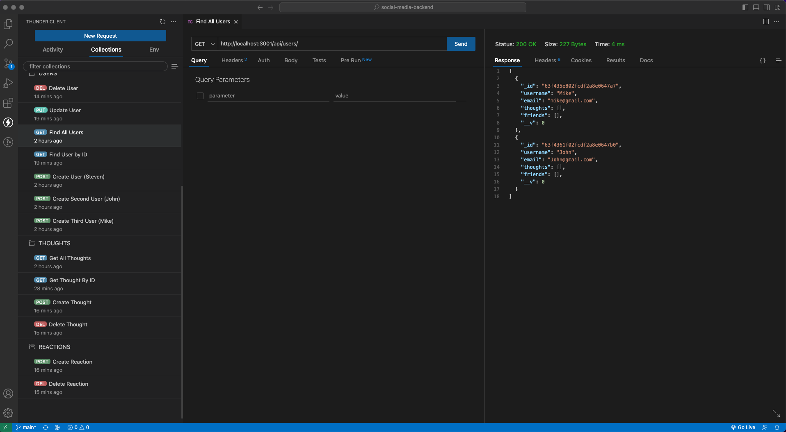

# Social-Media-Backend
## Description
This project is an API for a social network web application where users can share their thoughts, react to friends' thoughts, and create a friend list. The API is built using Express.js for routing, a MongoDB database for storing data, and the Mongoose ODM for interacting with the database.

MongoDB was chosen for its speed with large amounts of data and flexibility with unstructured data, making it a popular choice for many social networks.
## Table of Contents
* [Installation](#installation)
* [Links](#Links)
* [Usage](#usage)
* [License](#license)
* [Contribute](#contribute)
* [Report Bugs](#bugreport)
* [Questions](#questions)

## Installation

To get started, clone this repository and install the necessary dependencies.

Install Dependencies:
```js
$npm i
```
Start the Server:
```js
$npm run start
```
## Usage
Application Screenshot:


Demo Video:
https://drive.google.com/file/d/1Awa5ewOoIStMCMUmnukUEl2Loz7oy84N/view


## License 
   

  [Read more about MIT License here.](https://opensource.org/licenses/MIT)
  
  
## Contribute
N/A

## BugReport
- [E-mail Bug Report](mailto:smccombe93@gmail.com)

## Questions
Contact Links:
- [Github Profile](https://github.com/STEVEN-MCCOMBE)
- [E-mail Me](mailto:smccombe93@gmail.com)

